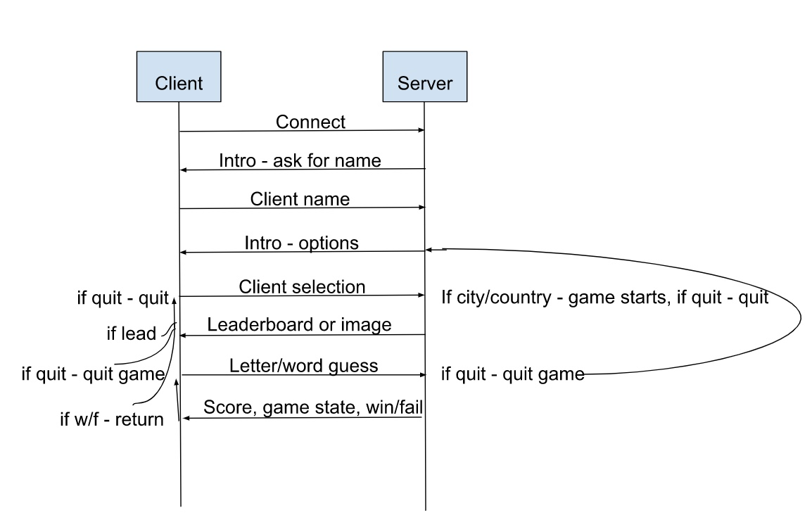
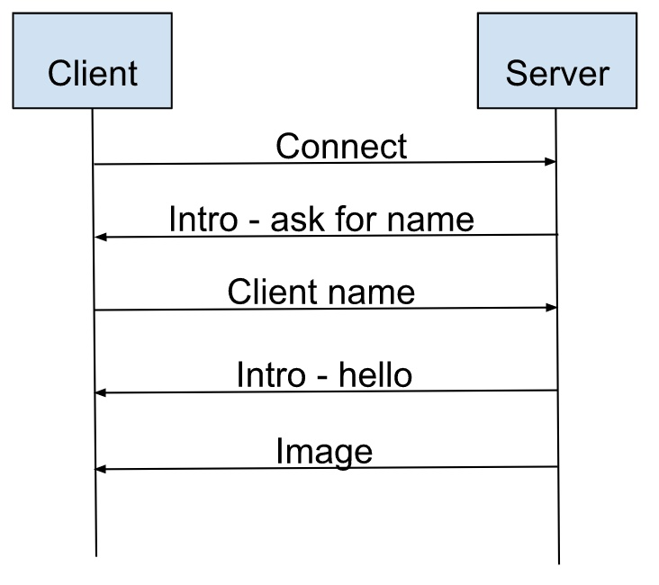

Base Code provided by David Clements so all kudos go to him!

## Description

Data is converted to a byte[] before transmission.

- Client connects to Server
- Client receives request for name
- Client sends name and receives greeting
- Client makes selection: "lead" for leaderboard, "city" or "country" for image and game start, "quit" for quit
  - If leaderboard, leaderboard is sent by Server and printed with another greeting
  - If city/country, image is sent and game starts - score and game state displayed
    - Client may enter letter or word, Server validates and updates game state/score until win, loss, or quit
      - If a Client completes the word or guesses the word, they win
      - If the Client guesses a letter, Server adds a point if correct - subtracts a point if incorrect
      - If the Client guess word, Server adds five points if correct - subtracts five points if incorrect
      - When Client score reaches zero or less, they lose and the game ends - greeting displayed

# TCP

## Running the example

`gradle runServerTCP`, `gradle runServerTCP -Pport = 8000`

`gradle runClientTCP`, `gradle runClientTCP -Pport = 8000 -Phost = localhost`


### Simple protocol

Client only sends name or request. 

```
{ 
	"name": <String: name>, "other": <String: request>
}
```
   
Server populates applicable field(s) based on Client request: 
   
```
{
   "img": <byte[]: image]>, "lead": <String: leaderboard>, "intro": <String: introduction>,
   "gameState": <String: current game state>, "score": <int: score>, "fail": <boolean: lose state>,
   "win": <boolean: wins state>
}
```
   
Server sends error if something goes wrong

```
{
	"error": <String: error> 
}
```
   
   
## Requirements
- [x] A description of your project and a detailed description of what it does.
- [x] An explanation of how we can run the program (hopefully exactly as described in this document).
- [x] A UML diagram showing the back and forth communication between client and server program. Which UML diagram you use is up to you (just for TCP).

- [x] A description of your protocol similar to what you usually see when a protocol is described. You should describe each request and all possible responses (including errors). See the add-on video on Canvas on the Sockets page for more details. This will be a very important point!
- [x] A link to a video in which you show your program running and all the features, should not be longer than 6minutes.
- [x] Explain how you designed your program to be robust (see later under constraints).
  - In order to design the program to be tolerant of errors, many try/catch blocks were created to correct myriad exceptions (IOException, FileNotFoundException, etc.).
  Handling for null pointer exceptions are generally handled by preemptive checks. Finally, and arguably most importantly,
  user input is managed very strictly to avoid errors sent between the Client and the Server. Any erroneous entry is simply
  treated as an invalid input and the control returns to the user.

- [x] When the user starts up it should connect to the server. The server will
reply by asking for the name of the player.
- [x] The user should send their name and the server should receive it and greet
   the user by name.
- [x] The user should be presented a choice between seeing a leader board or
   being allowed to guess a city or country (make the interface easy so a user will know
   what to do).
- [x] The leader board will show all players that have played since the first
   start of the server with their name and points. The server will maintain the leader
   board and send it to the client when requested. You can assume that the same name
   is the same player.
- [x] Add on: The leader board is persistent even when the server is restarted
   (we did not cover this in class yet though) – so this is extra credit.
- [x] If the user chooses city or county the server will send over an image and
   the blanks for the word we are searching for.
- [x] The image should be chosen randomly from the folder, it is ok if you show
   the same image a couple of times, you do not have to keep track of which you already
   used – you need to print the intended answer in the server terminal to simplify
   grading for us (this will be worth some points)
- [x] The user can then do one of three things; enter a letter guess (a one letter
   response), enter a word (guessing the word), type "quit" to end the game.
- [x] The user enters a guess (word or letter) and the server must check the
   guess and respond accordingly.
- [x] If it is a letter, and it is correct +1 point and the letter needs to be
    displayed in the UI at the correct place.
- [x] If it is a letter, and it is wrong -1 point and the points need to be updated
    in the UI, the game continues if the user has still more than 0 points.
- [x] If it is a word, and it is correct +5 point and the user is informed and the
    game ends.
- [x] If it is a word, and it is wrong -5 point and the user needs to be informed,
    the game continues if the user has still more than 0 points.
- [x] If the user types "quit" the client disconnects gracefully even during the
    game.
- [x] The current points the user has, have to be displayed in the UI. As soon
    as a user has 0 points, they lose. As long as they have more than 0 points they are
    still in the game.
- [x] If the player won add their new points to their old points on the leader
    board (or choose the highest value either is ok). You can assume that their name
    always identifies them.
- [x] Evaluations of the input needs to happen on the server side; the client will not know
    the images, the corresponding answers, the points, or the leader board. The correct
    answers should not be sent to the client. No real points for this since if this is
    not done then you do not really use the client/server correctly. So this will lead to
    deductions above.
- [x] Your protocol must be robust. If a command that is not understood
    is sent to the server or an incorrect parameterization of the command, then the
    protocol should define how these are indicated. Your protocol must have headers
    and optionally payloads. This means in the context of one logical message the
    receiver of the message has to be able to read a header, understand the metadata
    it provides, and use it to assist with processing a payload (if one is even present).
    This protocol needs to be described in detail in the README.md.
- [x] Your programs must be robust. If errors occur on either the client or server
    or if there is a network problem, you have to consider how these should be handled
    in the most recoverable and informative way possible. Implement good general error
    handling and output. Your client/server should not crash even when invalid inputs
    are provided by the user.
- [x] After the player wins/loses they get back to the main menu (this
    is different from my video demonstration so please do as this assignment says). The
    user can now quit, see the leader board or play another game.
- [ ] If a game is in progress and a second user tries to connect, they should receive a
    message that a game is already in progress, and they cannot connect. How exactly
    you handle this, whether you let the user wait or just do not let them do anything
    anymore, is up to you. DO NOT use threads, yes I know I am mean.


# UDP

The main differences can be seen in NetworkUtils.java.
In there the sending and reading of messages happen. For UDP the max buffer length is assumed to be 1024 bytes. So if the package is bigger it is split up into multiple packages.
Every package holds the information about the following data:
- totalPackets(4-byte int),  -- number of total packages
- currentPacket#(4-byte int),  -- number of current package
- payloadLength(4-byte int), -- length of the payload for this package
- payload(byte[]) -- payload
Additional changes are to the protocol itself, which only requires name from the Client and intro/img from the Server.

- Client connects to Server
- Client receives request for name
- Client sends name and receives greeting
- Client receives image and disconnects from Server

## Running the example

`gradle runServerUDP`, `gradle runServerUDP -Pport = 8000`

`gradle runClientUDP`, `gradle runClientUDP -Pport = 8000 -Phost = localhost`


### Simple protocol

Client only sends name.

```
{ 
	"name": <String: name>
}
```

Server populates applicable field(s) based on Client request:

```
{
   "img": <byte[]: image]>, "intro": <String: introduction>
}
```

Server sends error if something goes wrong

```
{
	"error": <String: error> 
}
```


## Requirements
- [x] A description of your project and a detailed description of what it does.
- [x] An explanation of how we can run the program (hopefully exactly as described in this document).
- [x] A UML diagram showing the back and forth communication between client and server program. Which UML diagram you use is up to you (just for TCP).
  
- [x] A description of your protocol similar to what you usually see when a protocol is described. You should describe each request and all possible responses (including errors). See the add-on video on Canvas on the Sockets page for more details. This will be a very important point!
- [x] A link to a video in which you show your program running and all the features, should not be longer than 6minutes.
- [x] Explain how you designed your program to be robust (see later under constraints).
  - In order to design the program to be tolerant of errors, many try/catch blocks were created to correct myriad exceptions (IOException, FileNotFoundException, etc.).
  Handling for null pointer exceptions are generally handled by preemptive checks. Finally, and arguably most importantly,
  user input is managed very strictly to avoid errors sent between the Client and the Server. Any erroneous entry is simply
  treated as an invalid input and the control returns to the user.

- [x] The asking and sending of the user’s name
- [x] Sending an image from the server to the client

